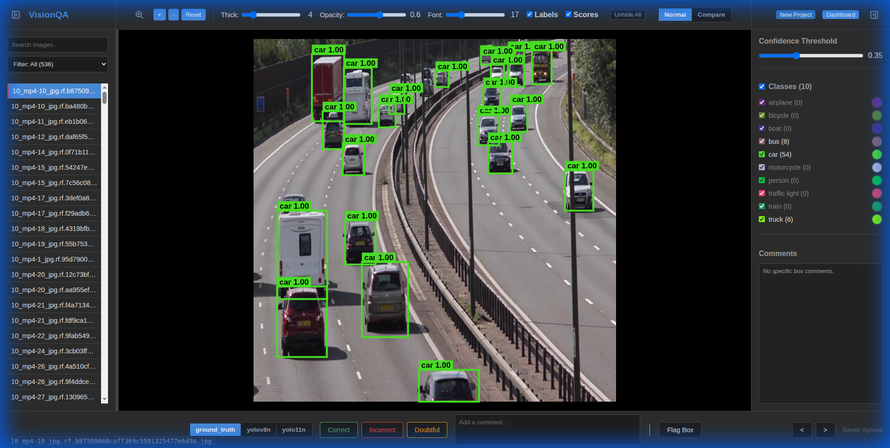
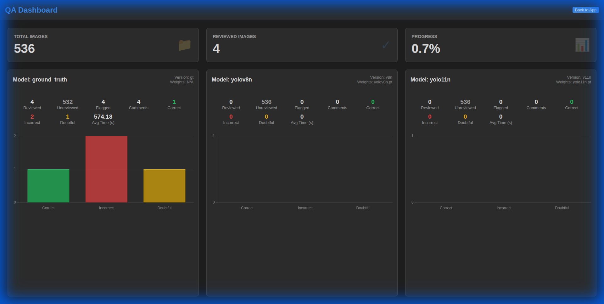

# VisionQA - YOLO Visualization & Analytics Tool

VisionQA is a powerful web-based tool designed for visualizing, comparing, and quality-assuring (QA) object detection models. It supports standard YOLO formats and generic JSON predictions, making it ideal for verifying model performance against ground truth and tracking dataset quality.



## Key Features

- **Multi-Model Visualization**: Visualize predictions from multiple models (e.g., YOLOv8, YOLO11) simultaneously on the same image.
- **Ground Truth Support**: seamless integration of YOLO-format ground truth annotations (`.txt`).
- **Interactive QA Workflow**: 
  - Mark images as "Correct", "Incorrect", or "Doubtful".
  - Add comments and flag specific bounding boxes.
  - Track review progress.
- **Comparison Mode**: Side-by-side view to compare two different models directly.
- **Analytics Dashboard**: Comprehensive statistics on model performance, class distribution, and QA progress.
- **Flexible Configuration**: simple `yaml` configuration for defining models, paths, and labels.



## Documentation

Comprehensive documentation is available in the `docs/` directory:

- **[Model Configuration](docs/MODEL_CONFIG_GUIDE.md)**: How to set up your `model_config.yaml`.
- **[Data Formats](docs/DATA_FORMATS.md)**: Details on supported annotation formats (JSON, YOLO TXT) and using the **Helper Script**.
- **[App Configuration](docs/APP_CONFIG_GUIDE.md)**: Global application settings.
- **[Visualization Controls](docs/VIZ_CONFIG_GUIDE.md)**: Customizing the visual output.

## Installation

### Prerequisites
- [Miniconda](https://docs.conda.io/en/latest/miniconda.html) or Anaconda.

### Setup

1.  **Create the environment**:
    ```bash
    conda create -n yolo_viz python=3.10
    conda activate yolo_viz
    ```

2.  **Install dependencies**:
    ```bash
    pip install -r requirements.txt
    ```

## Usage

### Starting the Server

Run the following command from the project root:

```bash
conda run -n yolo_viz uvicorn backend.main:app --host 0.0.0.0 --port 8765 --reload
```

*Note: If you are already inside the activated environment, you can simply run `uvicorn backend.main:app --host 0.0.0.0 --port 8765 --reload`.*

### Accessing the App

Open your browser and navigate to:
**[http://localhost:8765](http://localhost:8765)**

### Getting Started

1.  **Prepare your Project**: Organize your images and labels. Use `helper_script/detect.py` if you need to generate predictions from a YOLO model (see [Data Formats Guide](docs/DATA_FORMATS.md)).
2.  **Configure**: Create a `model_config.yaml` in your project folder (see [Model Config Guide](docs/MODEL_CONFIG_GUIDE.md)).
3.  **Load**: In the web app, click "Load Project" and select your project directory (e.g., `project2`).
4.  **Analyze**: Use the sidebar to navigate images, toggle models, and perform QA.

## Helper Scripts

The `helper_script/` directory contains useful tools:

- **`detect.py`**: Run inference using a YOLO model and save detections in the format expected by this tool.
  ```bash
  python helper_script/detect.py --model yolo11n.pt --source ./my_images --output ./my_predictions
  ```

## License

[MIT License](LICENSE)
